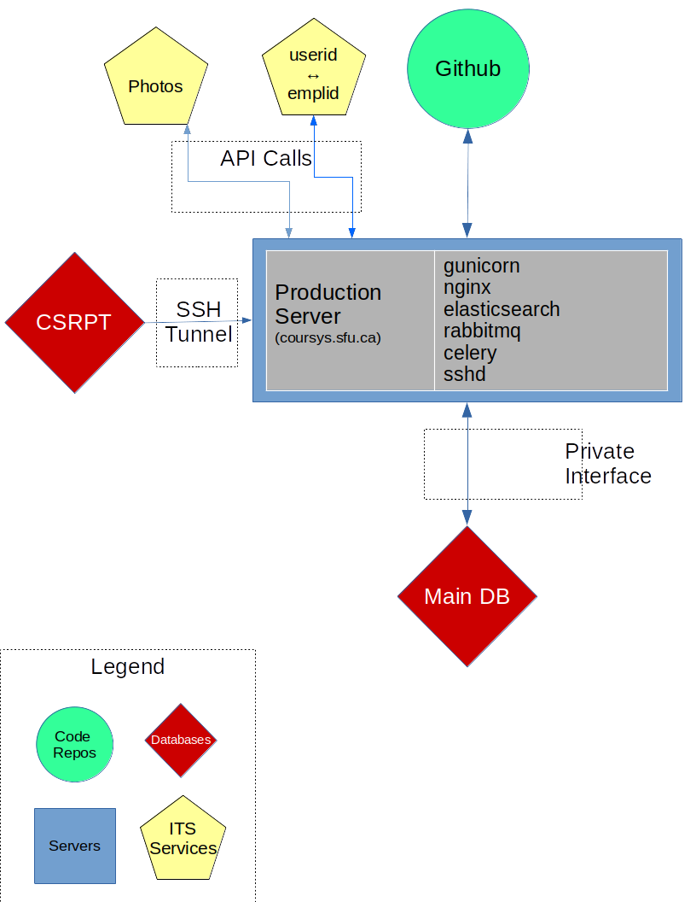

# CourSys Architecture

OK, that’s a pretty picture.  What does what?

## Production Server

As the name implies, it does most of the work.  

**Hosted by:**    Computing Science. 

**Architecture:**  It’s a Virtual Machine presently running Ubuntu 16.04.  The csilops have access to the virtual machine console.  

**Access:**   Besides that, only via SSH, and only with SSH keys.
 
**Servers:**

* sshd:  Obviously, so we can SSH in.
* gunicorn:  This is the Django server itself. The entire application is written in the Django framework.
* nginx:  The web server.
* elasticsearch:  Does most of the searching, particularly all the auto-complete stuff (like when searching for a person, course offering, etc.)
* celery:  This allows managing of various asynchronous and periodic tasks in separate queues for stuff that runs in batches and/or in the background.  This includes all our daily import tasks, a lot of the emails, etc.
* rabbitmq:  What actually transports the messages to celery.

*Important note:*  We are presently working on a new, more automated deployment process.  As such, several of these servers will most likely move to docker containers, for ease of maintenance and portability.

## Main Database

**Hosted by:**    Computing Science.
 
**Architecture:**  It’s a Virtual Machine, I think, running some flavour of Ubuntu and MySQL
  
**Access:**   We have no direct access to this at all.  Even the production server only talks to it via a private network interface only.  Csilops (or, at least two people for sure) have direct access to it.

This is the actual database for CourSys.  Every bit of data that we save or retrieve lives in there.  It’s rather important!

## GitHub
The code repository where the actual code lives.   See:  https://github.com/sfu-fas/coursys/  You probably got this file there!

All dev work should be pushed there.  There are multiple branches, including the obvious master branch.  The production server is serving the current deployed branch.  There is much information in there.  Code should be pushed to this repo, then pulled onto production.

## CSRPT

*Hosted by:*  IT Services

*Architecture:*  Some MSSQL database that gets refreshed once a day (allegedly, sometimes less) from the main SIMS database.

*Access:*   We can only talk to it after establishing an SSH tunnel.
  
Our source of “the truth” for anything SIMS-related.  We have read-only access to only one schema.  We pull a lot of data from there.  Every single course offering, class list, instructor list, etc, gets pulled from there every day. We also pull grad students for several units from there every day.
On top of that, we do some querying in real time for some demographic or academic data (mainly in advising).

## Photos

A service provided for us by ITS.  We use it to retrieve student photos for the advisors, class lists for instructors, and quizzes (to compare to what was submitted from the web cam).  We can only reach this via an API call for which we have a token.

## Userid/Emplid

Another service from ITS.  Everything in SIMS/CSRPT is referred to by employee ID (the 9 digit code).  But people log in via CAS, which only gives us a user ID (for example, ‘bob’, ‘user123’, etc).  How do we know which userid belongs to which employee ID, and vice-versa?  This is how.
Once again, this is an API call provided to us (and probably others).